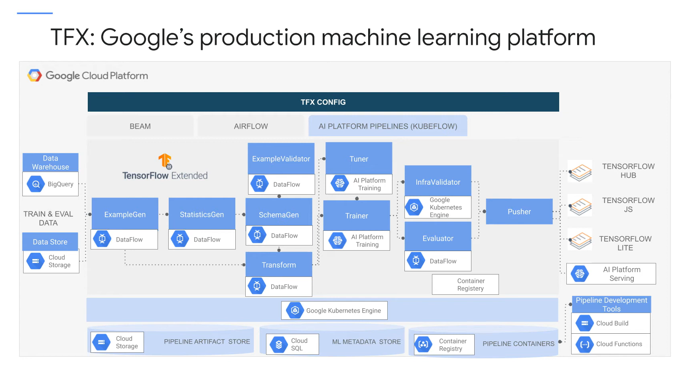

## Google Learning path

https://www.cloudskillsboost.google/course_templates/191

TFX tutorials : https://tensorflow.github.io/tfx/tutorials/

## Resources

https://github.com/GoogleCloudPlatform/mlops-on-gcp/tree/master (reusable)

https://github.com/sidoncloud/gcp-mlops/tree/main

https://github.com/iusztinpaul/energy-forecasting/blob/main/README_DEPLOY.md : interesting but too many technos

https://github.com/Harshit-crypto/gcp-github-trigger

https://github.com/simonloew/mlops_on_gcp?tab=readme-ov-file

## Course plan

### Notebook Lab

We may reuse this github notebooks : https://github.com/GoogleCloudPlatform/mlops-on-gcp/tree/master/workshops/tfx-caip-tf23
or this one https://github.com/GoogleCloudPlatform/mlops-on-gcp/tree/master/workshops/kfp-caip-sklearn

1. Introducing TFX

2. CI/CD

3. (Extra) Continuous training (aka CT)

### Introductory slides to useful concepts

CI
CD
CT 

Technos :
- Github actions / Gitlab CI
- Orchestrator : airflow, prefect, dagster...
- Docker
- Cloud

Make a summary of https://cloud.google.com/architecture/mlops-continuous-delivery-and-automation-pipelines-in-machine-learning?hl=fr ?

Focus on GCP :

TFX = ML E2E platform 

Applications: for broad use cases

Compatible infrastructures : For GCP and on-premise

Completely opensourced in 2019 : used at Alphabet of course but also Spotify, Twitter, Airbus

